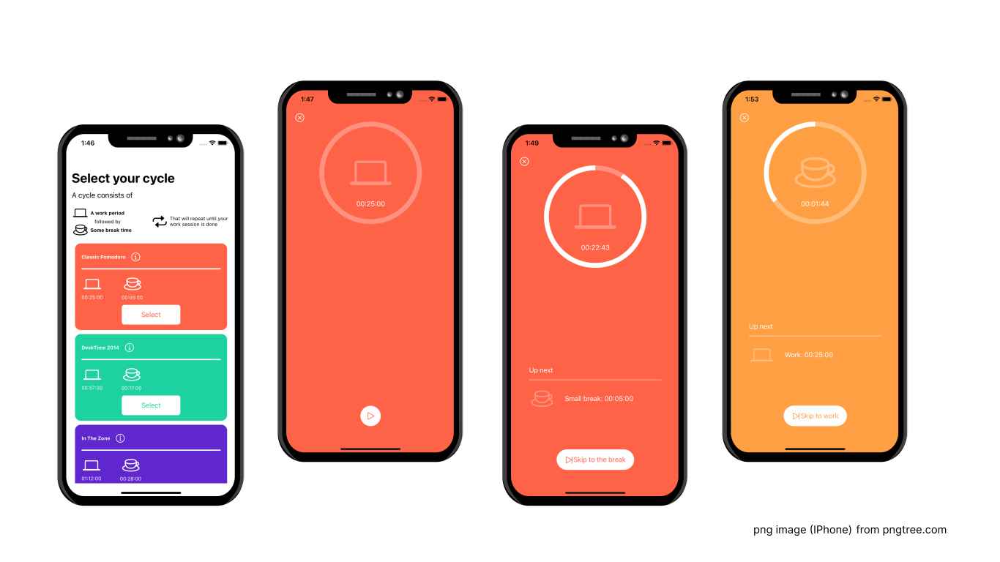

# IOS Pomodoro
A minimal Pomodoro App for IOS



### Description
The Pomodoro Technique is a time management method that involves 25-minute work sessions followed by 5-minute breaks to improve focus and efficiency. My iOS app allows users to choose between cycles with varying work and break durations.

This project was my final assignment for the "iOS Mobile Development and Maintenance using Swift" course, which I completed between May and August 2024 at the [Toronto School of Continuing Studies.](https://learn.utoronto.ca/)


### What I learned
In this project, I focused on mastering Swift's core principles, including Auto-Layout, the delegate pattern, capture lists, and MVVM architecture.

### Future features
While this is the first working version of the app, I plan to enhance it by improving optional unwrapping safety and implementing asynchronous processes. I also aim to add a feature that allows users to create their own custom Pomodoro cycles.


### Installation

This project is built and run using Xcode, to test it:
1. Install Xcode from the [App Store](https://developer.apple.com/download/)
2. ```git clone https://github.com/leoasimon/Pomodoro.git```
3. Open the project with Xcode
4. Run it: `cmd+r`

Good work session!! 🤓